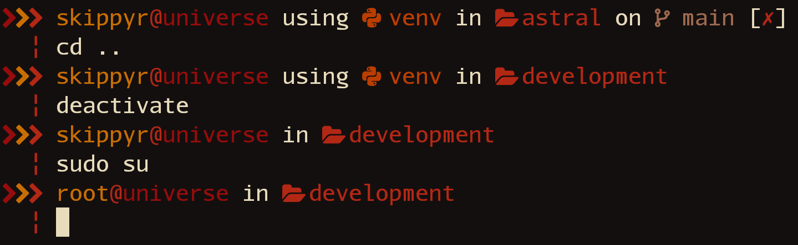

# Astral

## Starting Point

The Astral project is a colorful dual-line theme for the ZSH shell.

This theme can be setup with a series of terminal emulators, themes and wallpapers. You can use following preview as a source of inspiration and reference to see what it can look like:



> In this preview, the Astral theme was used within the [Kitty terminal emulator](https://github.com/kovidgoyal/kitty)
with the [Rosé Pine theme](https://github.com/kovidgoyal/kitty-themes/blob/master/themes/rose-pine.conf).
Font used is Source Code Pro Nerd Font. Wallpaper is [City buildings during night time by Zoe](https://unsplash.com/photos/BVoTTLwXvMQ) from Unsplash.

## Features

This theme can show you the following information:

* Your user and hostname.
* The name of sourced virtual environments.
* Your current directory path.
* If inside a Git repository, the name of the branch and if it has changes to
  be committed.

## Dependencies

This theme has some dependencies that you need to download before installing it.

* git

    This is the terminal utility used to obtain information about your Git
    repositories.

* A font patched by the Nerd Fonts project.

    This font provides all pretty symbols used in this theme.

## Installation

You can install this theme in multiple ways, use the one that suits you best.

### Manually

* Run the following command to install the theme at
  `~/.local/share/zsh/themes/astral`.

    ```bash
    git clone --depth=1 https://github.com/skippyr/astral ~/.local/share/zsh/themes/astral &&
    echo "source \"${HOME}/.local/share/zsh/themes/astral/astral.zsh-theme\"" >> ~/.zshrc
    ```

* Reopen your terminal emulator.

### Within OhMyZSH

* Install the theme in OhMyZSH custom themes' directory.

    ```bash
    git clone --depth=1 https://github.com/skippyr/astral ${ZSH_CUSTOM:-${HOME}/.oh-my-zsh/custom}/themes/astral
    ```

* Change the value of the `ZSH_THEME` variable in your ZSH configuration file,
  `~/.zshrc`, to use the theme.

    ```bash
    ZSH_THEME="astral/astral"
    ```

* Reopen your terminal emulator.


## Issues And Suggestions

Report issues and suggestions through the [issues tab](https://github.com/skippyr/astral/issues).

## License

This project is released under the terms of the MIT license. A copy of the
license is bundled with the source code.

Copyright (c) 2023, Sherman Rofeman. MIT license.
